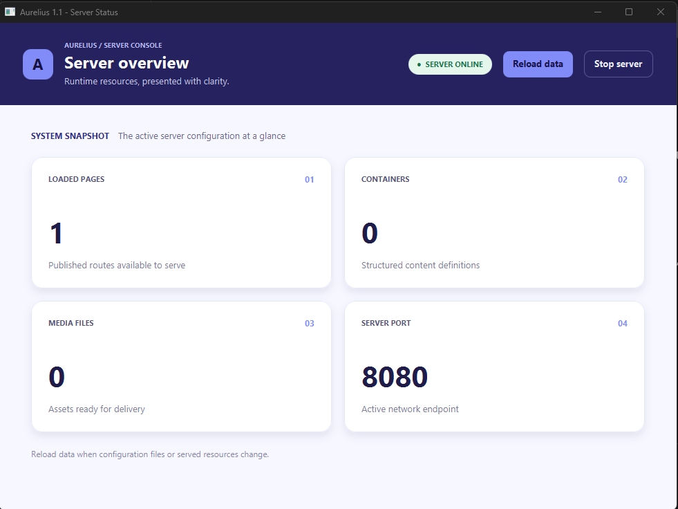

# Aurelius

A lightweight Netty web server for HTML pages, reusable HTML components, static media, and Java addon REST endpoints. An optional JavaFX desktop panel shows server status and provides reload and stop controls.



## Build and run

The current development version is **1.0-SNAPSHOT**, targeting **JDK 26** with JavaFX 26.0.1 and Netty 4.1.137.Final. Java 8 is no longer supported by this source version.

Requirements: JDK 26 and Maven. With `JAVA_HOME` pointing to JDK 26:

```sh
mvn verify
java -Dfile.encoding=UTF-8 -jar target/Aurelius-1.0-SNAPSHOT.jar
```

`mvn verify` runs the tests and builds a JAR containing the dependencies. Use `mvn test` to run only the tests. The current suite has 24 tests; build and packaging were verified locally on Windows with JDK 26. Other operating systems and the JavaFX UI have not been verified in this update.

Aurelius uses the **current working directory** as its application directory. On first launch it creates `settings.yml`, `placeholders.yml`, `app/main.html`, and `containers/`. The generated home page is empty; add your HTML, then restart. Visit `http://localhost:8080`.

For a server without a desktop, create the settings below with `ui: false` before starting. Generated settings otherwise enable the desktop panel.

## Configuration

```yaml
server:
  port: 8080
  threadSize: 0
  requestThreadSize: 0
  maxPendingRequests: 32
  ui: false
```

| Setting | Meaning |
| --- | --- |
| `port` | Listening port, 0–65535. Default: 8080; 0 lets the OS select a port. |
| `threadSize` | Netty I/O threads, 0–1024. 0 automatically selects up to 4 based on available processors. |
| `requestThreadSize` | Request worker threads, 0–1024. 0 automatically selects 2–8 based on available processors. |
| `maxPendingRequests` | Pending task limit per request worker, 16–65536; default 32. Connections are closed when submission is rejected. |
| `ui` | Enables the JavaFX panel. Must be a YAML boolean; omitted means false. |

Invalid setting types and out-of-range values stop startup. Request processing runs separately from I/O threads, with ordered execution per connection. HTTP request bodies are limited to 1 MiB. Restart after changing server settings.

## Pages and media

```text
application-directory/
├── settings.yml
├── placeholders.yml
├── app/
│   ├── main.html          # /
│   ├── main.css           # optional home-page styles
│   ├── main.js            # optional home-page script
│   ├── about/
│   │   └── page.html      # /about
│   └── 404/
│       └── page.html      # optional custom error page
├── containers/
│   └── button.html
├── public/
│   └── example.png       # /public/example.png
└── addons/
    └── example.jar
```

Subpages use `page.html` with optional `page.css` and `page.js` beside it. Nested folders create nested routes. Missing pages return HTTP 404, including when a custom error page is configured.

Create `public/` and `addons/` yourself when needed. Media discovery covers files directly inside `public/`. Supported extensions: `jpeg`, `jpg`, `png`, `mp4`, `yml`, `yaml`, and `json`.

```html

```

Media supports GET and HEAD. File contents are transferred through Netty file regions instead of loading the whole file into a byte array. Media responses close the connection after transfer.

## HTML components and placeholders

Define a reusable component in `containers/button.html`:

```html
<button>{text}</button>
```

Define global values in `placeholders.yml`:

```yaml
title: Aurelius
```

Use both in `app/main.html`:

```html
<!doctype html>
<html>
<body>
  <h1>%title%</h1>
  <container.button text="Continue"></container.button>
</body>
</html>
```

## Addons and REST

Place addon JARs in `addons/`. Each JAR needs an `addon.yml` resource declaring its entry class:

```yaml
main: com.example.MyAddon
```

The entry class extends `Addon`, provides a no-argument constructor, and implements `getAddonName()`, `onEnable()`, and `onDisable()`. Register routes from `onEnable()` using `AddonManager.registerRestFulService(...)` and `RestFulResponseStructure.Builder("hello")`; the route is exposed at `/api/hello`.

A REST controller implements `RestFulResponseStructure.RestFulResponse<R, B>`:

- `convert(String bodyJson)` parses the request body into `B`.
- `response(B body, RestFulResponseHelper helper)` returns `R`, serialized as JSON.
- The helper exposes remaining path segments and cookie support.

GET, POST, PUT, and DELETE are supported. Routing selects the longest matching endpoint at a path-segment boundary: `users` matches `/api/users/42`, but not `/api/usersExtra`. For the former, the remaining path data is `42`.

Missing endpoints return 404; unsupported methods return 405 with an `Allow` header. Conversion errors return 400 and controller/serialization errors return 500. The public registration API currently rejects duplicate route roots, even when their methods differ.

Examples: [website project](https://github.com/mustafabinguldev/aurelius-example-project) · [addon project](https://github.com/mustafabinguldev/AureliusExampleAddon). These are separate projects; check their build settings against JDK 26 before using them.

## Changes in this update

- Correct REST path matching, method selection, remaining path parameters, and HTML/REST error status codes.
- Shared JSON response handling writes directly to the response buffer, removing the temporary buffer leak; the Jackson overload compilation error is fixed.
- File-region media transfer, HEAD support, separate request workers, and bounded request queues.
- Validated worker settings, closed YAML input streams, and server shutdown without terminating the entire JVM.
- JDK 26 build configuration, pinned Lombok/annotations versions, and regression tests for routing, JSON, media, configuration, request handling, and server lifecycle.

Addon classloader cleanup and error reporting remain open work. No dependency security audit or concurrent large-file load test was performed in this update.
